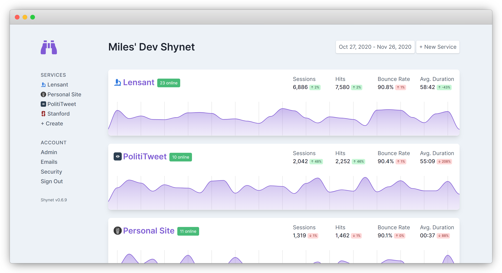

<p align="center">
  <h3 align="center">🔭 Shynet 🔭</h3>

  <p align="center">
     Web analytics that's self hosted, cookie free, privacy friendly, and useful(?) 
    <br>
    <br>
    <a href="#installation"><strong>Getting started »</strong></a>
    <br>
  </p>
</p>

## Motivation

There are a _lot_ of web analytics tools. Unfortunately, most of them come with the following caveats:

* They require handing all of your visitors' info to a third-party company
* They use cookies to track visitors across sessions, so you need to have those annoying cookie notices
* They collect so much personal data that even the NSA is jealous
* They are closed source and/or expensive, often with limited data portability
* They are hard to use

Shynet has **none** of these caveats. You host it yourself, so the data is _yours_. It works without cookies, so you don't need any intrusive cookie notices. It collects just enough data to be useful, but not enough to be creepy. It's open source and _intended_ to be self-hosted. And you may even find the interface easy to use.

> **Shynet** is a portmanteau of "Skynet" and "shy." The idea is that it gives you loads of useful information (Skynet) while also respecting your visitors' privacy (shy).

## Screenshots

_Note: These screenshots have been edited to hide sensitive data. The "real" Shynet has a lot more pages and information available, but hopefully this gives you an idea of the general look and feel of the tool._


_Shynet's homepage, where you can see all of your services at a glance._


_Shynet's service page, where you can see more detailed information about a service._

Not shown: management view, session view, full service view. (You'll need to install Shynet to see those!)

## Features

#### Architecture

* **Runs on a single machine** &mdash; Because it's so small, Shynet can easily run as a single docker container on a single small VPS.
* **...or across a giant Kubernetes cluster** &mdash; For higher traffic installations, Shynet can be deployed with as many parallelized ingress nodes as needed, with Redis caching and separate backend workers for database IO.
* **Built using Django** &mdash; Shynet is built using Django, so deploying, updating, and migrating can be done without headaches.
* **Multiple users and sites** &mdash; A single Shynet instance can support multiple users, each tracking multiple different sites.

#### Tracking

* **JavaScript not required** &mdash; It will fallback to using a 1x1 transparent tracking pixel if JavaScript isn't available
* **Lightweight** &mdash; The [tracking script](/shynet/analytics/templates/analytics/scripts/page.js) weighs less than a kilobyte (and doesn't look like your typical tracking script)
* **Generally not blocked** &mdash; Because you host Shynet yourself, it tends not to be on ad block lists
* **Primary-key integration** &mdash; You can easily associate visitors in Shynet with their user accounts on your site (if that's something you want)

#### Metrics

Here's the information Shynet can give you about your visitors:

* **Hits** &mdash; how many pages on your site were opened/viewed
* **Sessions** &mdash; how many times your site was visited (essentially a collection of hits)
* **Page load time** &mdash; how long the pages on your site look to load
* **Bounce rate** &mdash; the percentage of visitors who left after just one page
* **Duration** &mdash; how long visitors stayed on the site
* **Referrers** &mdash; the links visitors followed to get to your site
* **Locations** &mdash; the relative popularity of all the pages on your site
* **Operating system** &mdash; your visitors' OS (from user agent)
* **Browser** &mdash; your visitors' browser (from user agent)
* **Geographic location & network** &mdash; general location of your visitors (from IP)
* **Device type** &mdash; whether your visitors are using a desktop, tablet, or phone (from user agent)

#### Workflow
* **Collaboration built-in** &mdash; Administrators can easily share services with other users, as well
* **Accounts (or not)** &mdash; Shynet has a fully featured account management workflow (powered by [Django Allauth](https://github.com/pennersr/django-allauth/)).

## Recommendations

Shynet isn't for everyone. It's great for personal projects and small to medium size websites, but hasn't been tested with ultra-high traffic sites. It's also requires a fair amount of technical know-how to deploy and maintain, so if you need a one-click solution, you're best served with other tools. 

## Concepts

Shynet is pretty simple, but there are a few key terms you need to know in order to use it effectively:

**Services** are the properties on the web you'd like to track. These generally correspond to websites or single top-level domains. Shynet generates one tracking embed per service.

**Hits** are a single page-load on one of your services.

**Sessions** are a collection of hits (or just one) that are made by the same browser in a short period of time.

## Installation

To install Shynet using the simplest possible setup, follow these instructions. Instructions for multi-machine deployments will be available soon.

> **These commands assume Ubuntu.** If you're installing Shynet on a different platform, the process will be different.

1. Pull the latest version of Shynet using `docker pull milesmcc/shynet:latest`. If you don't have Docker installed, [install it](https://docs.docker.com/get-docker/).

2. Have a PostgreSQL server ready to go. This can be on the same machine as the deployment, or elsewhere. You'll just need a username, password, and host. (For info on how to setup a PostgreSQL server on Ubuntu, follow [this guide](https://www.digitalocean.com/community/tutorials/how-to-install-and-use-postgresql-on-ubuntu-18-04)).

3. Configure an environment file for Shynet. Be sure to swap out the variables below with the correct values for your setup.

```env
DEBUG=False # Don't leak error details to visitors
DB_NAME=<your db name>
DB_USER=<your db user>
DB_PASSWORD=<your db user password>
DB_HOST=<your db host>
DJANGO_SECRET_KEY=<your Django secret key; just a random string>
CELERY_TASK_ALWAYS_EAGER=True # Perform background processes on the main machine; this is what you want for now
ALLOWED_HOSTS="*" # For better security, set this to your deployment's domain. Comma separated.
SIGNUPS_ENABLED=False # Set to True (capitalized) if you want people to be able to sign up for your Shynet instance (not recommended)
TIME_ZONE="America/New_York" # Change as required

# The following settings are OPTIONAL and not necessary for most basic deployments
REDIS_CACHE_LOCATION="redis://redis.default.svc.cluster.local/0" 
CELERY_BROKER_URL="redis://redis.default.svc.cluster.local/1" # If set, make sure CELERY_TASK_ALWAYS_EAGER is False
EMAIL_HOST_USER: ""
EMAIL_HOST_PASSWORD: ""
EMAIL_HOST: ""
SERVER_EMAIL: "Shynet <noreply@shynet.example.com>"
```

4. Setup the Shynet database by running `docker run &mdash;env-file=<your env file> milesmcc/shynet:latest python manage.py migrate`.

5. Create your admin account by running `docker run &mdash;env-file=<your env file> milesmcc/shynet:latest python manage.py createsuperuser`.

6. Launch the Shynet server by running `docker run &mdash;env-file=<your env file> milesmcc/shynet:latest`.

7. With the server still running, visit it in a web browser. Go to `http://<your server's location>/admin` and log in with the credentials you setup in step 5. Click on "Sites", then "example.com". Update the values to match your deployment (the domain will be the domain where you'll _eventually_ host Shynet from, and the display name will be used to whitelabel Shynet throughout the management interface). When you're ready, click "Save".

8. Visit your service's homepage, and verify everything looks right!

**Next steps:** while out of the scope of this short guide, next steps include setting up Shynet behind a reverse proxy (be it your own [Nginx server](https://docs.nginx.com/nginx/admin-guide/web-server/reverse-proxy/) or [Cloudflare](https://cloudflare.com)), making it run in the background, and integrating it on your sites. Integration instructions are available on each service's management page.


## FAQ

**Does Shynet respond to Do Not Track (DNT) signals?** It's on the [roadmap](#roadmap). While there isn't any standardized way to handle DNT requests, the plan is to give services the option of ignoring DNT signals entirely, limiting collected data (i.e. not collecting any visitor-related details such as browser, IP, etc.), or excluding DNT requests from analytics entirely.  

**Is this GDPR compliant?** I think so, but it also depends on how you use it. If you're worried about GDPR, you should talk to a lawyer about your particular data collection practices. I am not a lawyer.

## Roadmap

The following features are planned:

* **Rollups** (aggregate old data to save space)
* **Anomaly detection** (get email alerts when you get a traffic spike or dip)
* **Interactive traffic heatmap** (see where in the world your visitors are coming from)
* **Better collaboration interface** (the current interface is... a draft)
* **Data deletion tool** (easily prune user data by specifying an ID or IP)
* **Differential privacy** (explore and share your data without revealing any personal information)
* **Do Not Track support** (change tracking behavior in response to DNT signals)   

## In the Wild

These sites use Shynet to monitor usage without violating visitors' privacy: [PolitiTweet](https://polititweet.org), [Miles' personal site](https://miles.land), [a17t](https://a17t.miles.land), [Lensant](https://lensant.com), [WhoAreMyRepresentatives.org](https://whoaremyrepresentatives.org), and more. (Want to add your site to this list? Send a PR.) 

## Contributing

Are you interested in contributing to Shynet? Just send a pull request! Maybe once the project matures there will be more detailed contribution guidelines, but for now just send the code this way. Just know that by contributing, you agree to share all of your contributions under the same license as the project (see [LICENSE](LICENSE)).

## License

Shynet is made available under the [Apache License, version 2.0](LICENSE).

---

a17t was created by [Miles McCain](https://miles.land) at the [Recurse Center](https://recurse.com).